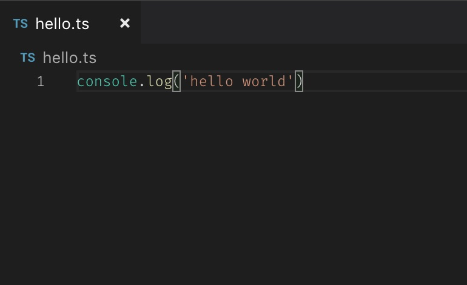

Oh, arise my glorious castle in the internet fantasy land.

<figure>
  
  <figcaption>
    
      A timeless classic.
      <small>
      Credit: 
      
        Teemu Koivisto
      
      </small>
    
  </figcaption>
</figure>

It has taken me now what, about 1 week of working days to get this site up and running? It has been long time coming, this blog thing. At one point I was trying out Jekyll, then Hugo but each time I faced some little-bitty thing that I wanted to do differently. So I guess I'm stuck with using this custom-made Gatsby setup, which is good, don't get me wrong. Maybe a little too much boilerplate and strange configuration, but hey it works! So alles gut.

Anyway this project is *far* from finished and there's some things that I have to figure out how to do or fix. For example how to correctly render the metatags for SEO bots to crawl, react-helmet renders them only **after** the page has loaded in JS so they won't show up to the crawlers, oh well (EDIT: was fixed by adding `gatsby-plugin-react-helmet` plugin :D). All in time. This won't face much of traffic anyway so why over-engineer it? Haha, stupid question - because I can! No stingy eyed project manager here to tell me to use my time on more 'useful things'.

All the code that I've used to build this should be available on GitHub, the infra stack is still work in progress so I haven't made it public yet.

Is this good enough? It probably is good enough. I have to just ... do ... this ... one ... more ... thing and *then* I am ready. Humm humm, so why am I here still writing? I should go back to work!